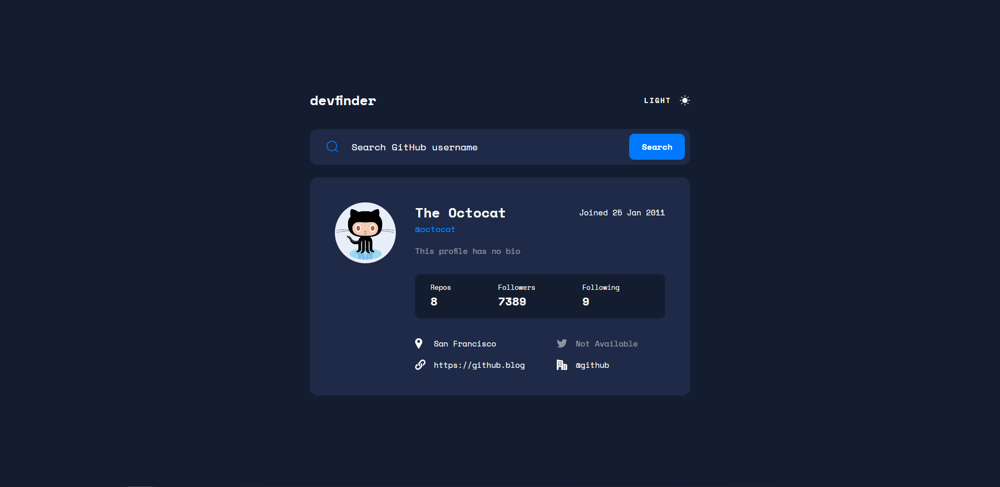

# Frontend Mentor - GitHub user search app solution

This is a solution to the [GitHub user search app challenge on Frontend Mentor](https://www.frontendmentor.io/challenges/github-user-search-app-Q09YOgaH6). Frontend Mentor challenges help you improve your coding skills by building realistic projects. 

## Table of contents

- [Overview](#overview)
  - [The challenge](#the-challenge)
  - [Screenshot](#screenshot)
  - [Links](#links)
- [My process](#my-process)
  - [Built with](#built-with)
  - [What I learned](#what-i-learned)
  - [Continued development](#continued-development)
  - [Useful resources](#useful-resources)
- [Author](#author)

**Note: Delete this note and update the table of contents based on what sections you keep.**

## Overview

### The challenge

Users should be able to:

- View the optimal layout for the app depending on their device's screen size
- See hover states for all interactive elements on the page
- Search for GitHub users by their username
- See relevant user information based on their search
- Switch between light and dark themes
- **Bonus**: Have the correct color scheme chosen for them based on their computer preferences. _Hint_: Research `prefers-color-scheme` in CSS.

### Screenshot

### Links

- Solution URL: [https://github.com/cganzon/devfinder-react](https://github.com/cganzon/devfinder-react)
- Live Site URL: [https://devfinder-cg.netlify.app/](https://devfinder-cg.netlify.app/)

## My process

### Built with

- [React](https://reactjs.org/) - JS library
- Local storage
- Mobile-first workflow
- Flexbox
- CSS custom properties

### What I learned

This was my first React project that I've completed, so I definitely learned a lot. I got a lot of practice with components, props, state, event listeners, and how forms work. I look forward to learning more complex React concepts and applying them to future projects.

### Continued development

I would like to learn more about the different React hooks in the future. I was able to incorporate the useEffect() hook in this project, but even then I am still a little confused on its actual purpose and true potential.

### Useful resources

- [FCC React Beginner Course](https://www.youtube.com/watch?v=bMknfKXIFA8&t=36252s&ab_channel=freeCodeCamp.org) - I essentially used everything I learned in this video to build this app, so I recommend checking it out if you're looking to take your first dive into React!
- [Create a Persisting Dark Mode with React](https://www.pullrequest.com/blog/create-a-persisting-dark-mode-with-react/) - I used this blog post to help me implement the persisting light/dark mode functionality.

## Author

- Website - [My GitHub account](https://github.com/cganzon)
- Frontend Mentor - [@cganzon](https://www.frontendmentor.io/profile/cganzon)
